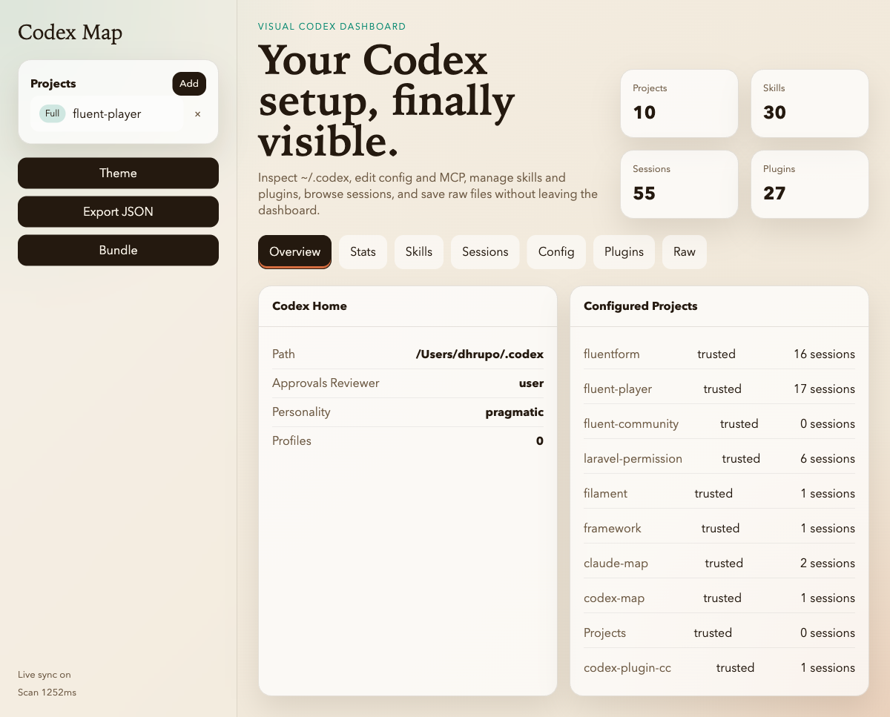
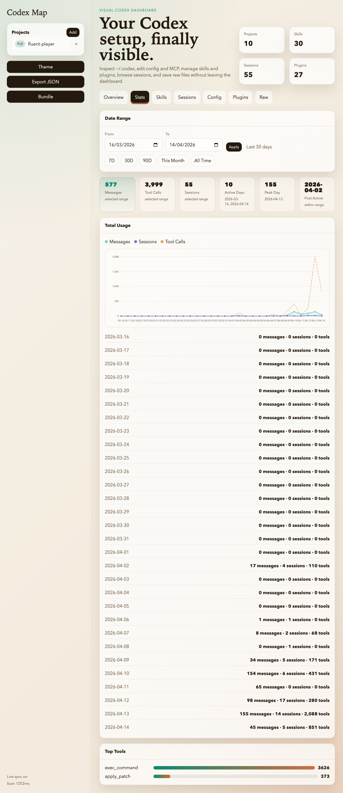
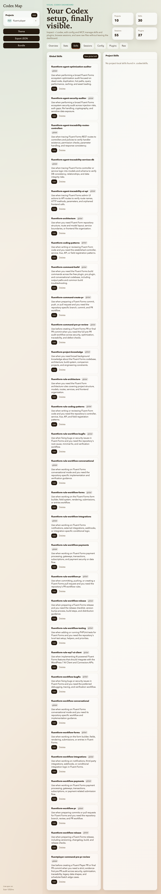
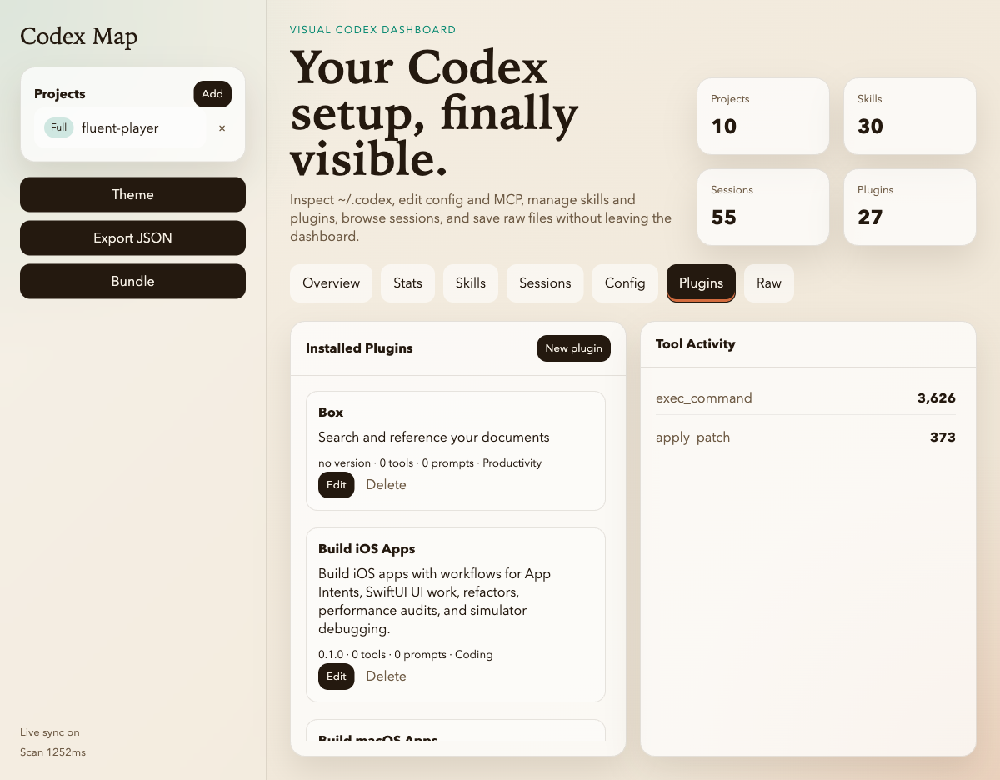
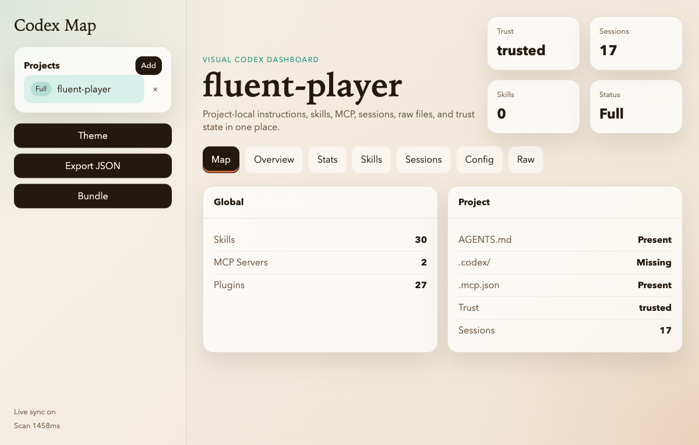
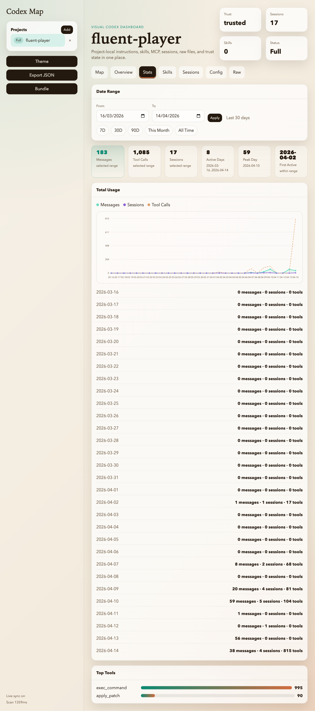
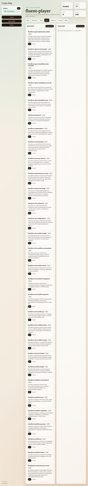

# Codex Map

Visual dashboard for inspecting and mapping your Codex CLI setup.

`codex-map` makes `~/.codex` and project overlays visible:

- Browse session history and copy `codex resume <id>` instantly
- Compare global skills and project-local `.codex/skills` side by side
- Inspect `config.toml`, trusted projects, MCP servers, plugins, and `AGENTS.md`
- Export a full JSON scan or a smaller bundle for sharing with teammates

## Install

```bash
npm install -g codex-map
```

Or run it without installing:

```bash
npx codex-map
```

Then open `http://localhost:3131`.

## Local Development

```bash
npm install
npm run dev
```

## Screenshots

### Global Dashboard






### Project View





## What It Reads

- `~/.codex/config.toml`
- `~/.codex/skills/`
- `~/.codex/history.jsonl`
- `~/.codex/session_index.jsonl`
- `~/.codex/sessions/`
- `~/.codex/.tmp/plugins/plugins/*/.codex-plugin/plugin.json`
- Project-local `AGENTS.md`, `.codex/skills/`, and `.mcp.json`
